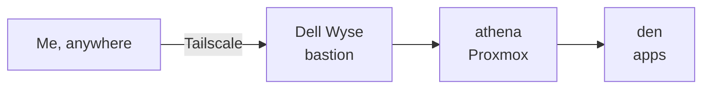
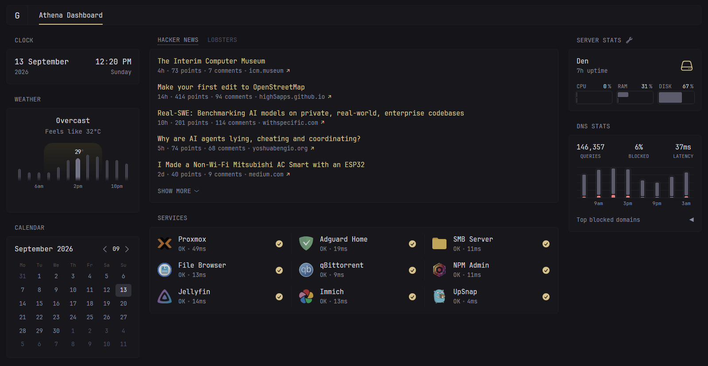
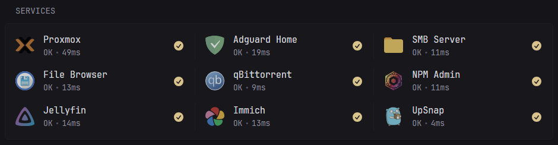
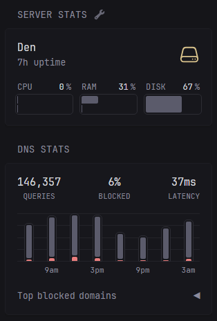

My home lab runs on three layers, each nested inside the one before it: a small Dell
Wyse that lets me in, a mini PC called **athena** that runs Proxmox, and a VM inside
it called **den** that runs all of my apps.

## The front door: a Dell Wyse

The entry point is a small Dell Wyse thin client with Tailscale on it. When I'm away
from home, that's how I get in: I connect to the tailnet, reach the Wyse, and go from
there.

A thin client suits this job well. It's small and quiet, and it has nothing else to
do. It also keeps the way in off the machine that runs everything else, so I can
still reach the network while athena is being rebooted or rebuilt.

## The hypervisor: athena

athena is a mini PC running Proxmox. Everything I host runs inside it as a virtual
machine, which means I can snapshot, rebuild or experiment without touching the
hardware.

## Where the apps live: den

den is the VM inside athena, and it's where every app runs, each in its own Docker
container:

- **Jellyfin** for movies and shows
- **Immich** for photo backup
- **qBittorrent** for downloads
- **File Browser** to get at files from a browser
- **A Samba share** so my other machines can use den's storage
- **UpSnap** to wake machines on the network
- **AdGuard Home** to block ads for the whole network
- **Nginx Proxy Manager** so each app gets a proper name instead of a port number
- **Glance** to keep an eye on all of it

## The dashboard

Glance is the page I actually open. It gathers everything onto one screen: the time
and weather, a calendar, Hacker News and Lobsters, and the state of every service I
run.

The services panel is the part I rely on most. Glance checks each app once a minute,
shows a tick when it responds, and says how long the response took.

On the right, Glance shows how hard den is working, plus how many DNS queries AdGuard
has answered and how many of them it blocked.

