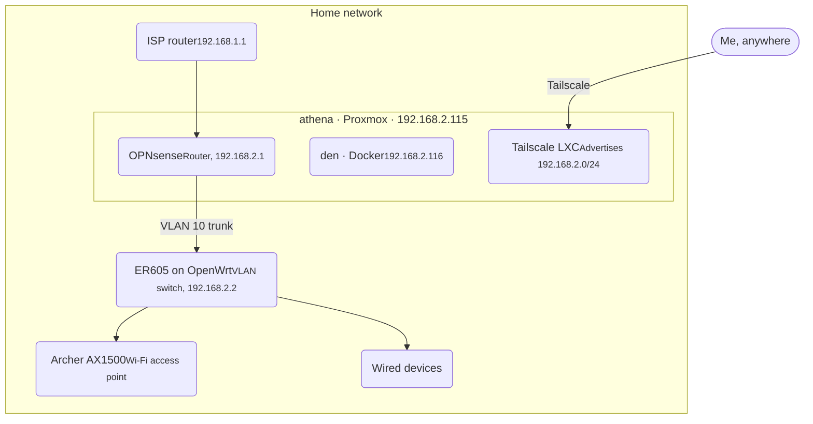
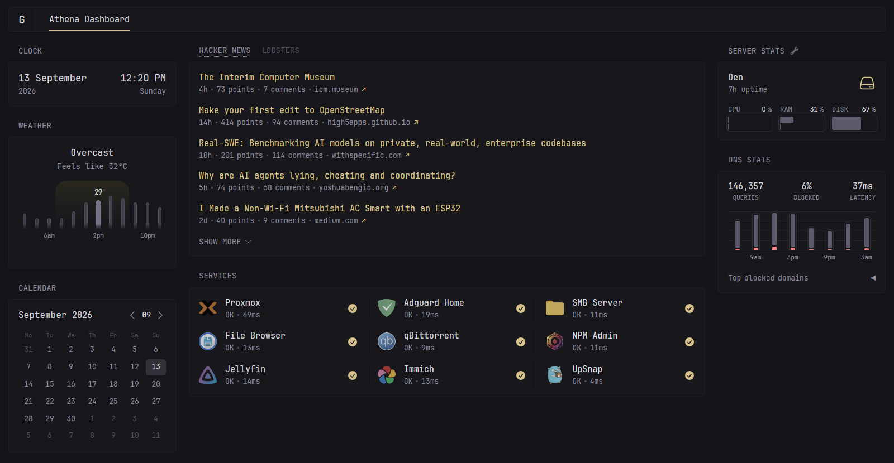

## Overview
My homelab consists of a mini PC and a 3D-printed rack. The mini PC is responsible for being my router 
along with being a place for my self-hosted apps. 
It is an HP EliteDesk Mini which I added an extra NIC to, so that I can run OPNsense. 
The PC runs Proxmox, which manages the OPNsense VM along with Tailscale and the Docker VM containing all my apps.

The plan in the future is to have more mini PCs added so I can play around with Kubernetes.
My primary reason to build it was to learn networking and get more comfortable with Linux to help me better my skills for the day job.

```mermaid
flowchart TB
  me(["Me, anywhere"]):::gray

  subgraph home["Home network"]
    isp("ISP router<small>192.168.1.1</small>"):::gray

    subgraph athena["athena · Proxmox · 192.168.2.115"]
      opn("OPNsense<small>Router, 192.168.2.1</small>"):::green
      den("den · Docker<small>192.168.2.116</small>"):::pink
      ts("Tailscale LXC<small>Advertises 192.168.2.0/24</small>"):::blue
    end

    er("ER605 on OpenWrt<small>VLAN switch, 192.168.2.2</small>"):::yellow
    ap("Archer AX1500<small>Wi-Fi access point</small>"):::purple
    wired("Wired devices"):::gray
  end

  isp --> opn
  opn -- "VLAN 10 trunk" --> er
  er --> ap
  er --> wired
  me -- Tailscale --> ts
```

The mini PC has two network ports. The onboard Realtek carries WAN, and an M.2 Intel
I226-V carries the LAN trunk to the switch. OPNsense uses bridged virtio NICs instead
of PCI passthrough. 
The ER605 used to route the network. Now it runs OpenWrt and does nothing but switch
VLAN-tagged traffic.

## The Mini Rack

[**Modular 10" Server Rack**](https://makerworld.com/en/models/1452571-modular-10-server-rack#profileId-1513461) from MakerWorld. 
Most of the long parts in this were modified so I can print it using my
A1 Mini. Pretty handy what a few sessions with Claude and some callipers can get you
now.  I am very amateur in terms of 3D modelling so this was a godsend for me.

Have a play around with the model!

## How the network is managed

- AdGuard serves as my DNS, which provides me with network-wide adblock and private DNS routing.
- Tailscale runs in its own LXC and advertises my subnet _192.168.2.0/24_ to my tailnet. This allows
me to connect to any of the devices connected to my OPNsense.

## What apps do I self-host

I host all my Docker containers on another VM I call "The Den".

- **Jellyfin** for movies and shows
- **Immich** for photo backup
- **qBittorrent** for downloads
- **File Browser** and **SMB share** so I can host a NAS
- **UpSnap** to wake machines on the network
- **AdGuard Home** to serve as my DNS
- **Nginx Proxy Manager** so each app gets a proper name instead of a port number
- **Glance**, my dashboard of choice

## The dashboard
Glance is my current dashboard of choice that I have set up. It has a very simple-to-configure UI which I use to show some basic things, along with an RSS feed, the status of my services, my storage status and my DNS stats.

